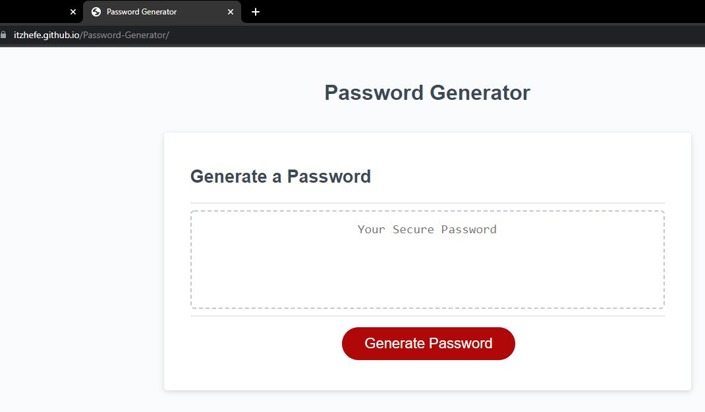
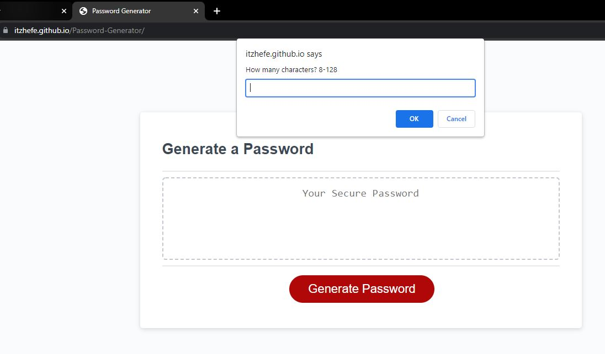
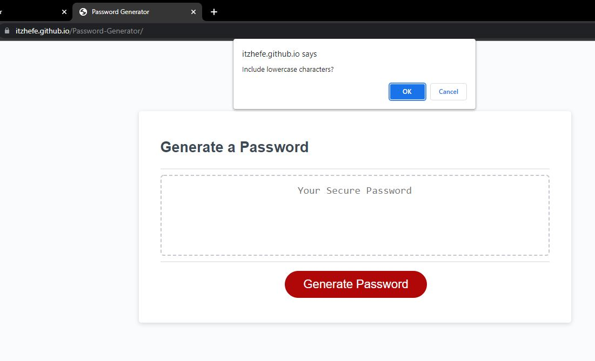
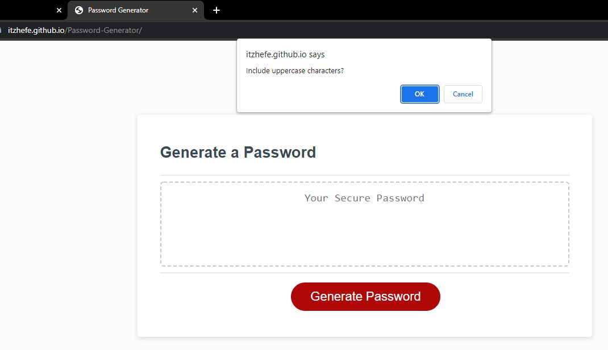
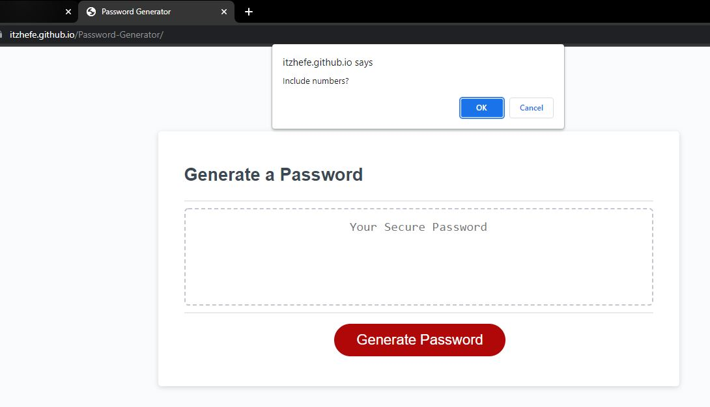
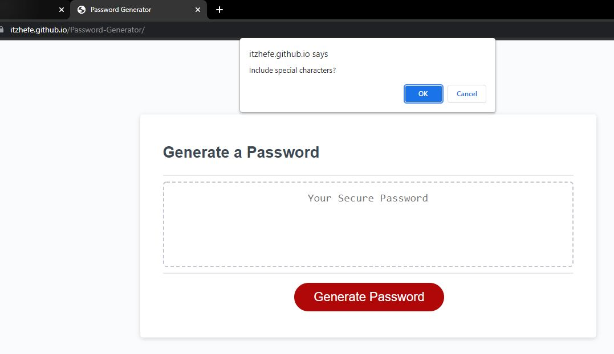
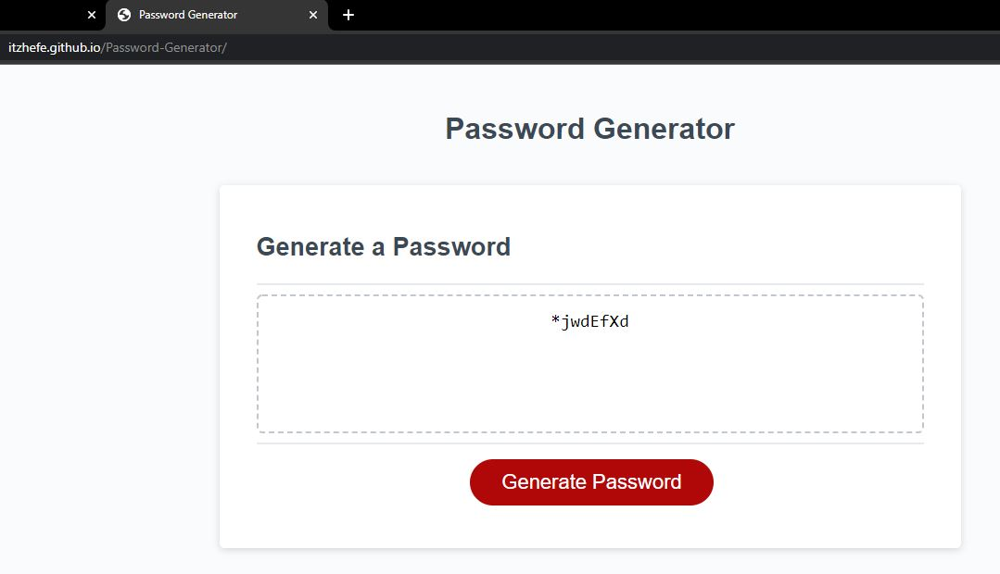

# Password-Generator

In this assignment we were tasked with creating a password generator while taking into consideration specific criteria from the user.

## Specific Criteria 

1. User inputs the number of characters needed for their password
2. User selects whether they want to include lowercase characters
3. User selects whether they want to include uppercase characters
4. User selects whether they want to include numbers in their password
5. User selects whether they want to include special characters in the password

All of these unique criteria are prompted when they "click" on the "generate password" button.

### Screenshots of working functionality:

Landing page:

First Prompt:

Second Prompt:

third Prompt:

Fourth Prompt:

Fifth Prompt:

Generated Password:
